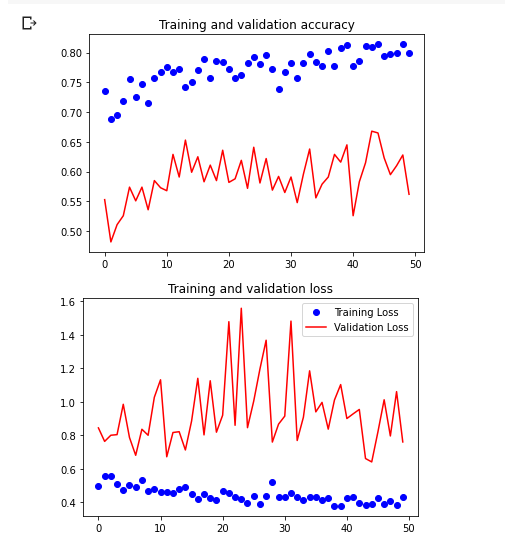

# Espial

## Introduction 
Surveillance ensures safety and security, an integral part of every individual’s life, Thus Cameras are installed everywhere. But still news of crime resonates throughout the year. Who is looking at those footage prior to an incident? They appear to have become just an evidence collecting source.   
 
### 🔭 &nbsp; About this Project

Through this project, we aim to convert a **CCTV surveillance from an evidence collection device to a crime prevention and detection tool to ensure safety and security**.
The system will detect and simultaneously alert any suspicious activity captured by the camera through a notification which will be sent to the concerned authority. The technologies encompasses domains of Computer Vision and Deep Learning models like **CNN, R-CNN, LSTM**. The dataset consists of 2000+ videos scraped off internet and categorized into ***violent and non-violent*** activities. 
  

### 🛠 &nbsp;Tech Stack
&nbsp;
&nbsp;
&nbsp;
&nbsp;
&nbsp;
  

### 💼 &nbsp; Working

 
   
 The system is majorly governed by our Website, with all the processes working in sync with it. The current tensorflow model is hosted on the camera itself, with periodic notiffications being pushed to the server. A valid auth key is used to verify the cameras. 
 
To see the test results for our model, please follow the following steps:
- Execute the file labelled test.py using command line
    > python3 test.py

 

*Note :* This Website required **OpenCV, Numpy, Django** and **Tensorflow** installed on the host machine. To install these dependencies, run the following command
> pip3 install -r requirements.txt
  
 
###  ✍️ &nbsp; Current Progress
We tried and tested various architectures for this project. A brief summary and stats for each is given below:
1. **Customised CNN Model**: The customised CNN model with optimised parameters performed well on the training and sufficiently good in the test dataset. The architecture is currently being used by the website and test.ipynb file.

    - Accuracy on training: 0.7990
    - Loss on training: 0.4292
    - Val_loss: 0.7605
    - Val_accuracy: 0.6680
    - Optimizer: Adam
    - Loss: BinaryCrossEntropy
    - Epochs: 50
    - steps_per_epoch: 50 
      
    
      

2. **VGG Net**: VGGNet Architecture displayed an accuracy of 60% on training and 55% on testing dataset.
    - Testing Accuracy: 0.5513
      
    
      

3. **AlexNet**: AlexNet showed accuracy of 57% on training and a similar accuracy on the testing dataset. 
    - Testing Accuracy: 0.5729
      
    
      

4. **Inception+CustomisedCNN**: Using transfer learning of Inception Architecture and passing it to CustomisedCNN trained the model with satisfactory results. 
*Link to model file* : [Google Drive Link](https://drive.google.com/file/d/1yTbm7oMn1znMEOD7X-s9NDqtyvpUZfTe/view?usp=sharing)
    - Training_accuracy: 89%
    - Validation_accuracy: 76%
    - Epochs: 30
    - Steps per Epoch: 100
    - Optimizer: RMSprop with LR 0.0001
    - Loss: Binarycrossentropy
      
    
      

### ⚙️ &nbsp; Ultimate Objective
The model uses the technique of Multiple Object Detection with Localization tracking the movement of people and then categorizing it into violent or non-violent behavior. Our proposed solution will ensure Public Safety and security without any human toil with an instant alert to the concerned authorities. With our deep learning model integrated with your application, and personalised user login which detects and sends the notifications in real time to the concerned authority in case any suspicious activity is detected. We aim to curb the constant rise of criminal activities, their unexpectedness, and scope of harm.
